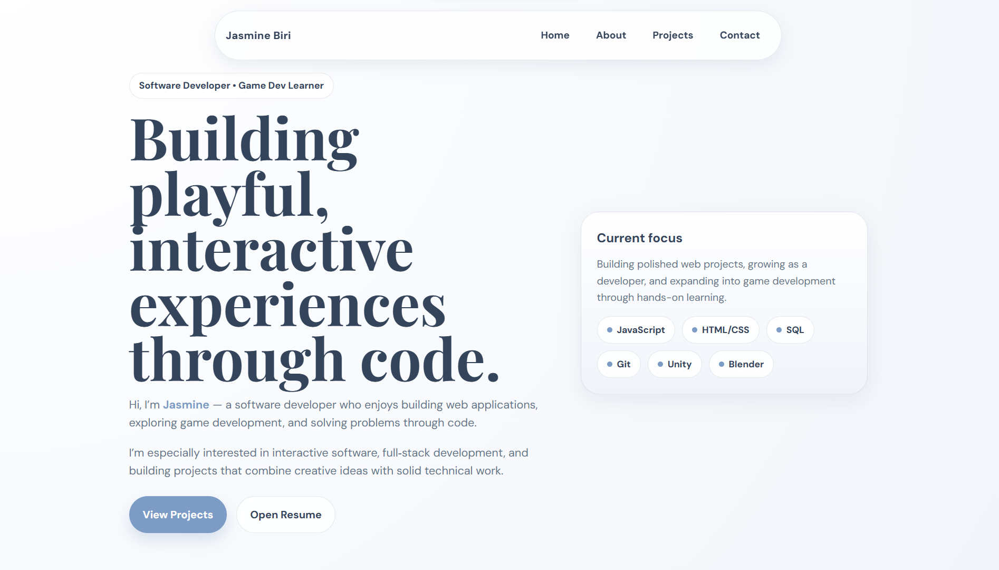

# Jasmine Biri | Portfolio

My personal developer portfolio website, built to introduce who I am and showcase selected projects.

🔗 **Live site:** [jbiri03.github.io/portfolio](https://jbiri03.github.io/portfolio/index.html)

## Preview



## About

I’m Jasmine Biri, a Software Engineering graduate and developer interested in full-stack web development, backend systems, deployment, and game development.

This site serves as a central place to view my work, learn more about each project, and visit live project pages.

## Features

- About section
- Interactive project showcase with clickable project cards
- Dedicated detail pages for each featured project
- Links to live project pages
- Responsive design for desktop and mobile devices
- Contact section with a contact form

## Projects

Each project card on the site can be selected to view more information about the project and open its live page.

Featured projects include:

- **Taco Tom's Lonchera** — A restaurant website I designed and built end to end, with a secure admin panel for real-time menu management.
- **Cake Idle Clicker** — A browser-based idle game featuring progression systems, interactive upgrades, and persistent gameplay data.


## Built With

- HTML
- CSS
- JavaScript
- GitHub Pages

## Run Locally

1. Clone the repository:

   ```bash
   git clone https://github.com/jbiri03/portfolio.git
   ```

2. Open the project folder in your code editor.

3. Open `index.html` in a browser, or use the Live Server extension in VS Code.

## Contact

- GitHub: [@jbiri03](https://github.com/jbiri03)
- LinkedIn: [Jasmine Biri](https://www.linkedin.com/in/jasmine-biri-738559190)
- Email: jasminebiri03@gmail.com